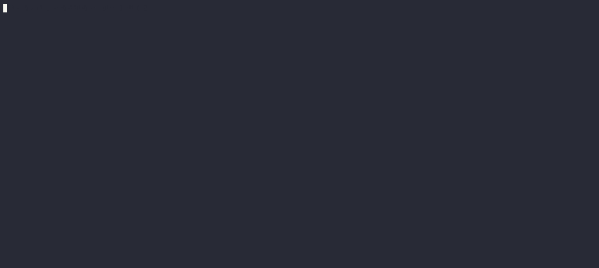

# CDDL
[](https://github.com/HannesKimara/cddlc/actions/workflows/go.yml)
[](https://pkg.go.dev/github.com/HannesKimara/cddlc)

Golang implementation for Concise Data Definition Language (CDDL). CDDL is an [IETF standard](https://www.rfc-editor.org/rfc/rfc8610) whose main goal is to provide an easy and unambiguous way to express structures for protocol messages and data formats that use CBOR or JSON.

> **Warning**<br/>
This repository is still in active development and may introduce breaking changes. Do not use in production

## Installation
### Go library

``` sh
go get -u github.com/HannesKimara/cddlc
```

### cddlc tool
```sh
go install github.com/HannesKimara/cddlc/cmd/cddlc@latest
```

## Getting Started 



To get started using the parser library visit the [docs](https://pkg.go.dev/github.com/HannesKimara/cddlc). The docs to the `cddlc` tool are available [here](https://cddlc.github.io/docs)

## Supported features
| CDDL | Parser | Code Generator |
|------|--------|----------------|
| identifiers <br/> (`basic`, `hyphen-separated`, *`weird..ones` ...) | &#9745; | &#9745;* |
| primitives <br/>(`bool`, `false`, `true`, `tstr`, `text`, `"text_literal"`, `float`, `float16`, `float32`, `float64`, `uint`, `int`, `nint`, `bstr`, `bytes`, `null/nil`) | &#9745; | &#9745; |
| occurrence operators<br/>(`*`, `+`, `?`) | &#9745; | &#9744; |
| choice operators<br/>(`/`, `//`) | &#9745; | &#9744; |
| composition operators <br/>(`~`) | &#9745; | &#9744; |
| comparable control operators<br/>(`.lt`, `.le`, `.gt`, `.ge`, `.eq`, `.ne`) | &#9745; | &#9744; |
| constraint control operators<br/>(`.size`, `.regexp`) | &#9745; | &#9744; |
| collections <br/>(`groups ()`, `arrays []`, `structs {}`) | &#9745; | &#9744; |

> **Note**<br/>
`*` means that the cddl construct may not be fully supported in a particular context such as identifer translation during code generation.

## License

This project is licensed under the Apache-2.0 license. Please see the [LICENSE](LICENSE) file for more details.
